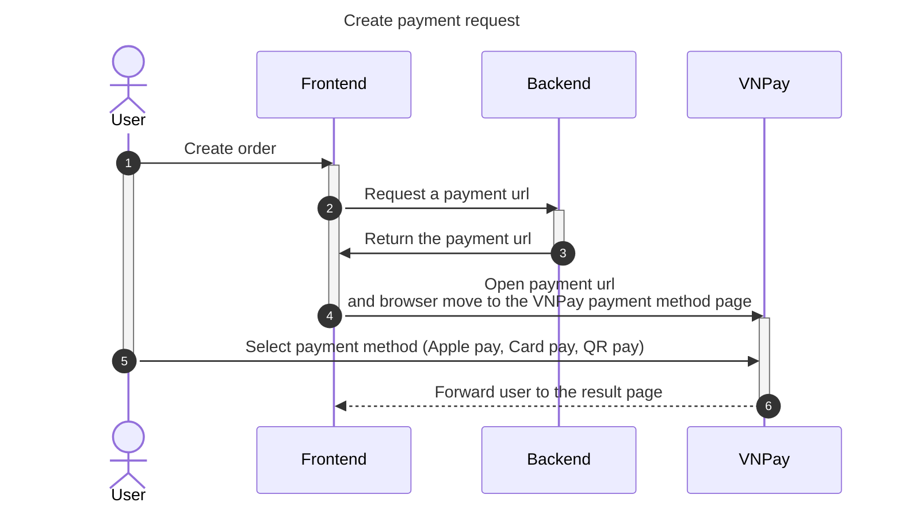

# How to run

1. Setup environment

- Register a test account here: https://sandbox.vnpayment.vn/devreg

- Wait for VNPay send the configure information to registered email

- Copy and paste `vnp_TmnCode`, `vnp_HashSecret` to `.env` file.

1. Install dependencies

```
go mod tidy
go mod vendor
```

2. Run the application

Again from the server directory run:

```sh
go run ./main/main.go
```

3. Go to `localhost:10000/pay` to see the demo.

# One time payment flow



````mermaid
sequenceDiagram
    title Update payment result

    actor Dev
    participant VNPay
    participant Backend
    autonumber

    Dev ->> VNPay: Setup IPN url
    activate VNPay
    VNPay ->> Backend: Send payment result on each new payment
    deactivate VNPay```
````
